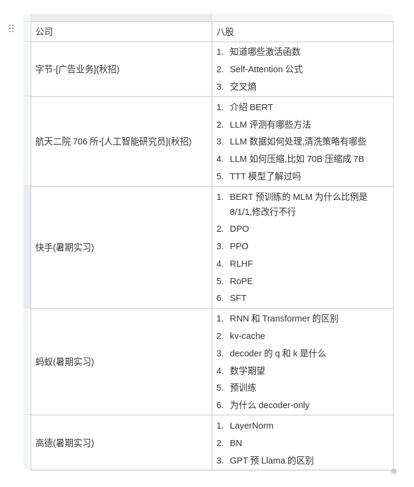

文档链接：https://docs.qq.com/doc/DVXZhaUZNaE5hUHdF
# 优化器
note:阶数为梯度的幂 
1. moment-SGD
增加一阶动量，考虑之前或者上一时间步的梯度方向，帮助越过一些局部最优，通用表达如下：
$$
m_{k} = \beta m_{k-1} + (1 - \beta)g
$$
3. RMSprop优化器，二阶动量，解决自适应学习率的问题，通常作为梯度的系数的分母，在更新过程中，该值会变得越来越大，更新幅度就会越来越小。具体实现为，通过移动平均加权，对当前二阶梯度值和上一步二阶动量加权，避免某一步梯度过大，导致后续更新的步长越来越小。
4. adam优化器，结合一阶动量和二阶动量的优点，更新步长为一阶动量除以二阶动量。另外，adam中一个重要的问题是刚启动的问题，名为偏差校正，即当前一阶动量和二阶动量要除以$1-\beta^{k}$。k是时间步，随着时间步增大，开始阶段放大一阶动量和二阶动量，是其接近期望的估计值，但随着k增大，其影响越来越小。公式如下：

$$
g = \nabla_{\theta_{k-1}}L(\theta)
$$
$$
m_{k} = \beta_{1} m_{k-1} + (1 - \beta_{1})g
$$
$$
v{k} = \beta_{2} v_{k-1} + (1 - \beta_{2})g \odot g 
$$
$$
\hat{m_{k}} = m_{k}/(1-\beta_{1}^{k}), \quad \hat{v_{k}} = v_{k}/(1-\beta_{2}^{k})
$$
$$
\theta_{k} = \theta_{k-1} - \eta \frac{\hat{m_{k}}}{\hat{v_{k}} + \epsilon}
$$
$eta$是lr, 自适应调整部分是$\hat{m_{k}}/(\hat{v_{k}} + \epsilon）$
# 归一化
### BN、LN、RMSNorm
- BN：batch size维度上reduce
- LN：hidden state 维度上reduce
 $$
 x_{i} = \frac{x_{i} - \mathbb{E}[X]}{\sqrt{Var[X]} + \epsilon} \cdot \gamma + \beta
 $$  
- RMSnorm(llama)：
LN的变体，区别与LN的是，其去中心化，每个token特征的维度各有各的中心，即不减均值，也不算方差，仅仅除以特征值的二阶矩估计量，再按位乘以一个特征维度大小的可学习参数，省略均值和方差的计算，有加速的效果。
 $$
 x_{i} = \frac{x_{i}}{\sqrt{\sum_{i}^{d} x_{i}^{2}} + \epsilon}\cdot \gamma
 $$  
- post-norm：先残差后norm，pre-norm:先norm后残差
- pre不如post的直观原因：pre使得第一层和最后一层的值很像，而post会放突出每层的特性，所以post网络更具表达性
  
# 面试题
 
